### Hi there 👋

Wow, this really has a MySpace vibe going on, doesn't it? I wonder if I can set up some background tunes. 🤔

I'm a Senior Software Engineer at [Akamai Technologies](https://akamai.com). My primary interest is [WebAssembly](https://webassembly.org/), but off-hours I enjoy game development (both board games and video games), building (and playing) guitars, gardening, carpentry, and painting.

I maintain a few personal projects that you may find useful:

1. [azure-blob-storage-upload](https://github.com/bacongobbler/azure-blob-storage-upload) - A [Github Action](https://docs.github.com/en/actions) for uploading files to Azure Blob Storage.
2. [bevy_simple_networking](https://github.com/bacongobbler/bevy_simple_networking) - A library for the Bevy game engine used to develop online multiplayer games.

I am also an [Emeritus org maintainer](https://github.com/helm/community/blob/main/MAINTAINERS.md) and [Emeritus core maintainer of the Helm project](https://github.com/helm/helm/blob/e46a81654083eb8b0110915c964592876e077dde/OWNERS#L18).

#### Contact

Hit me up at [matt.fisher@fermyon.com](mailto:matt.fisher@fermyon.com).
